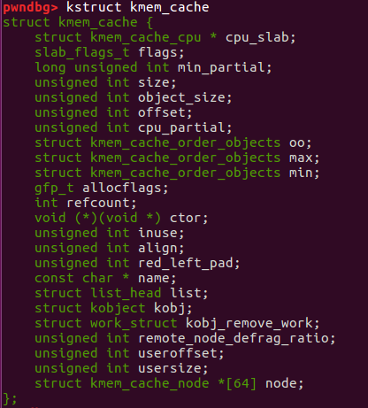
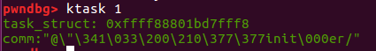
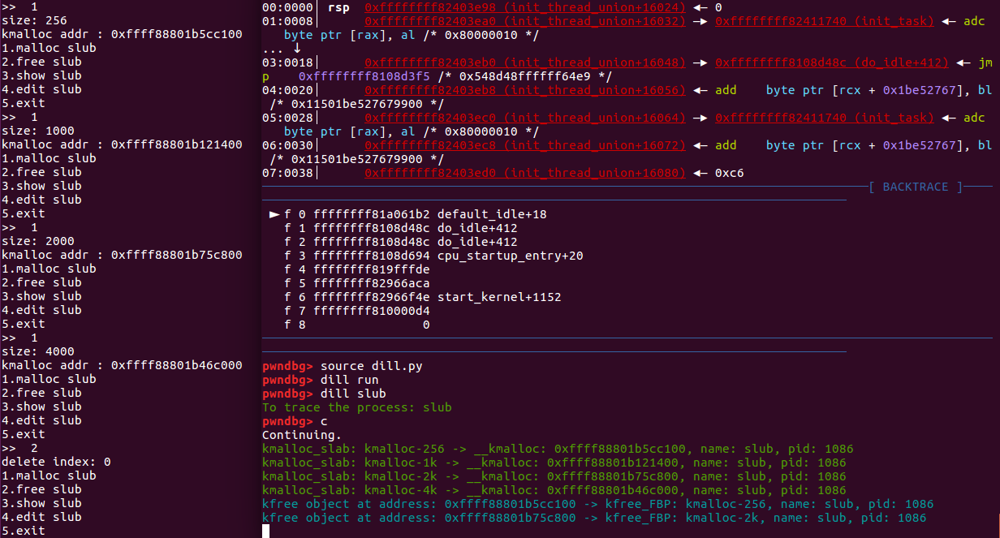

### 文档说明

dill 是一个用于linux kernel调试的gdb 插件，基于gdb 的python api开发。

主要功能包括如下：

（1）kbase 获取当前的内核基址：  

（2） kstruct 得到特定的数据结构：

以及某个字段在数据结构中的偏移：

（3）ktask 获取某个进程的task_struct 地址 

（4）kcache 获得特定类型kmem_cache 的freelist, partial  

输出主要分成四个部分：

1. 关于kmem_cache结构的一些信息  
2. kmem_cache_cpu 上的freelist  
3. kmem_cache_cpu partial上各个page挂的freelist  
4. kmem_cache_node partial上各个page挂的freelist

（5）dill 跟踪某个进程的堆分配，以及释放

dill 模块的功能包括：  
（1）dill run ：对要跟踪的函数打上断点  
（2）dill process_name : 跟踪对应进程的堆分配和释放，会输出分配/释放的slab类型，以及堆块地址
（3）dill on/off ：对输出日志进行开启/关闭  

slub 分配原理：

### 参考链接

https://github.com/PaoloMonti42/salt/tree/master/docs  
https://sourceware.org/gdb/onlinedocs/gdb/Python-API.html  
https://www.anquanke.com/post/id/200161  
https://my.oschina.net/fileoptions/blog/1630346  

